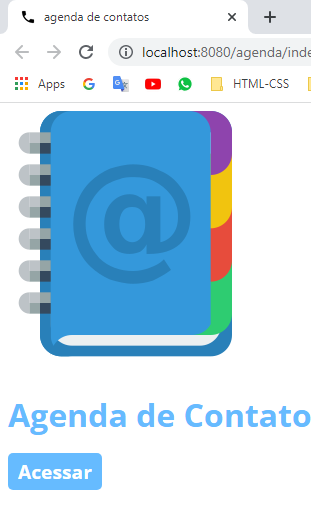
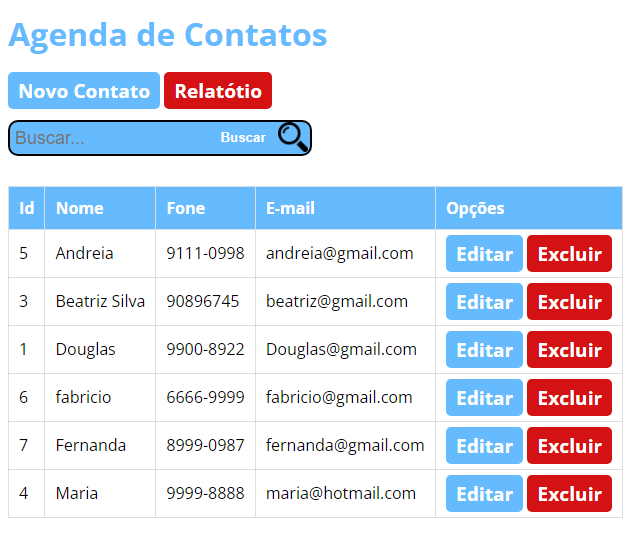
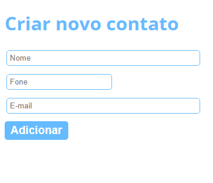
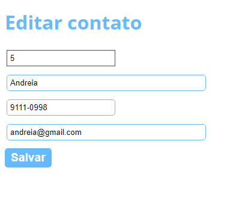
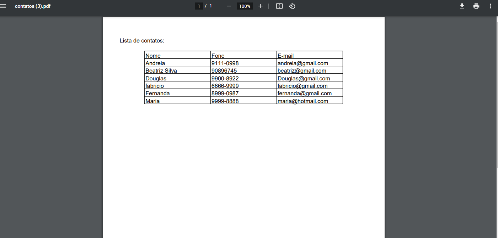

<h1 alinn="center">Agenda de Contatos</h1>

Agenda de contatos com sistema CRUD adicionar,visualizar,atualizar,remover e relatório 

Sistema desenvolvido com Java, HTML,CSS,Javascript e MySQL

<h2>Telas</h2>

Tela Inicial

Contatos

Adicionar

Editar

relatorio PDF

<h2>Histórico de lançamentos</h2>
<ul>
  <li>Versão 0.0.1</li>
  <ul>
    <li>Sistema em Desenvolvimento</li>
  </ul>
  <li>Proxima Versão 0.0.2</li>
  <ul>
    <li></li>
  </ul>
</ul>

<h2>Contribuir</h2>
<ul>
  <li>Faça o fork do projeto (https://github.com/yourname/yourproject/fork)</li>
  <li>Crie uma branch para sua modificação (git checkout -b feature/fooBar)</li>
  <li>Faça o commit (git commit -am 'Add some fooBar')</li>
  <li>Push (git push origin feature/fooBar)</li>
  <li>Crie um novo Pull Request</li>
</ul>
